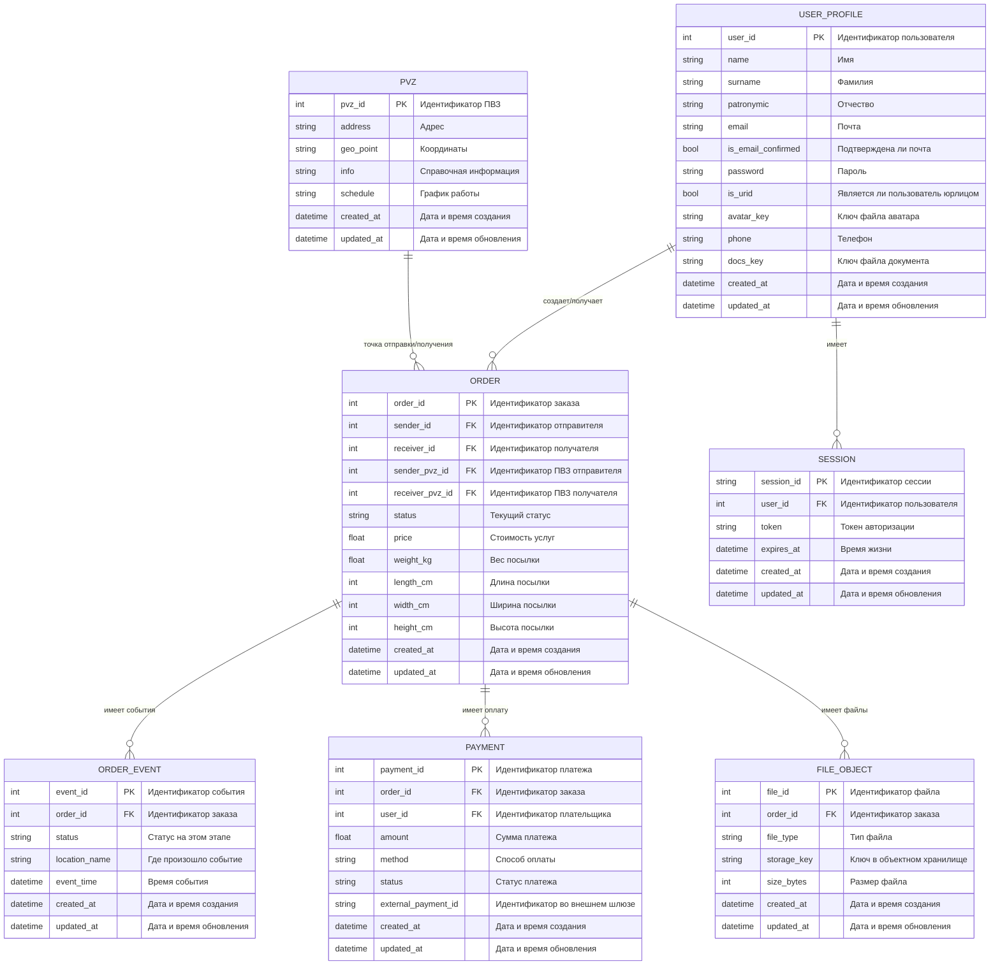
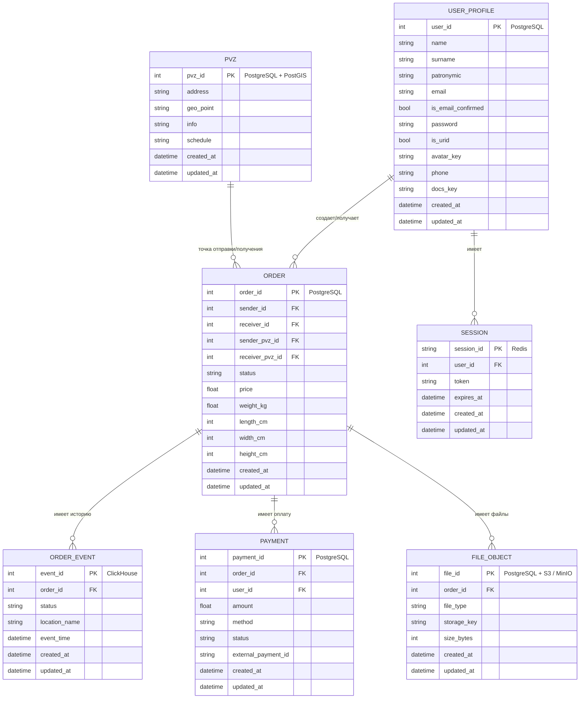

# ДЗ №1: Тема и целевая аудитория сервиса CDEK

**CDEK** — российский оператор доставки документов и грузов.

---

### Целевая аудитория
* **MAU (Monthly Active Users):** 23.6 миллионов (РФ)

### Основной функционал
* Создание заказов
* Трекинг заказов (+ оповещения о статусе заказа)
* Расчет стоимости доставки
* Определение маршрута доставки
* Просмотр пунктов выдачи на картах
* Поиск пунктов выдачи по фильтрам/геолокации
* Интеграция с логистической платформой через CDEK API
* Прием платежей по СБП (CDEK PAY)

### Ссылки и источники
1. [Официальный сайт CDEK](https://www.cdek.ru/)
2. [Статья в Wikipedia](https://ru.wikipedia.org/wiki/%D0%A1%D0%94%D0%AD%D0%9A)
3. [Статистика трафика на similarweb](https://www.similarweb.com/website/cdek.ru/#traffic)

  
# ДЗ №2 Расчет нагрузки для cdek.ru

### Продуктовые метрики

| Метрика | Значение | Пояснение |
| :--- | :--- | :--- |
| **MAU** | **18 600 000** | Взято с официального сайта cdek.ru [[1]](https://www.cdek.ru/)  |
| **DAU** | **3 720 000** | Рассчитано как 20% от MAU [[2]](https://yandex.ru/adv/edu/materials/metriki-mau-wau-dau) |
| **Ср. количество заказов** | **400 000 / день** | 123 млн посылок в год / 365 дней (данные за 2025 год с официального сайта cdek.ru) |
| **Хранение на пользователя** | **~0,5 МБ / 20 объектов** | История заказов за год, данные профиля (реквизиты, сканы документов и прочее) |

#### Действия пользователя
| Действие | Среднее количество запросов в день от одного пользователя|
| :--- | :--- | 
| **Создание заказа** | 0,1 | 
| **Трекинг** | 2,7 | 
| **Расчет стоимости** | 0,7 | 
| **Определение маршрута доставки** | 1,0 | 
| **Поиск ПВЗ** | 0,9 | 
| **CDEK API** | 29,4 | 
| **Итого (без CDEK API)** | **4,2** |

Примечание: CDEK API действия расчитываются на одно юридическое лицо. По данным сайта cdek.ru на 2026 год на платформе зарегистрировано 850 000 активных юр. лиц. [[1]](https://www.cdek.ru/ru/history/)
  
### Технические метрики

Согласно блогу компании на habr.com суммарный объем хранилища составлял > 30 ТБ на конец 2024 года [[3]](https://habr.com/ru/companies/cdek_blog/articles/881618/)

#### Объем хранилища (данные заказов указаны за год)

| Тип данных | Объектов, шт | Объем | Пояснение |
| :--- | :--- | :--- | :--- |
| **Данные заказов** | 123 000 000 | 8.13 ТБ | ~71 КБ/объект |
| **Профили** | 25 000 000 | 0.16 ТБ | ~7 КБ/объект |
| **Пункты выдачи** | 8 600 [[5]](https://calculator-dostavki.ru/cdek-offices) | 0.0006 ТБ | ~73 КБ/объект |
| **Итого** | | **24,55 ТБ** | Данные заказов указаны за год / срок их хранения я не нашел, поэтому примем его равным 3 годам (посчитаем объем данных заказов, как х3)

Примечания:
* Для расчтета размера данных примем, что строчные поля занимают 256 Байт, числовые - 4 Байта, картинки - 70 КБ.

#### Расчет RPS

| Метод | Суточный объем | Средний RPS | Пиковый RPS | Пиковое потребление | Суммарный суточный трафик |
| :--- | :--- | :--- | :--- | :--- | :--- |
| **Создание заказа** | 400 000 | 5 | 25 | 0,029 Гбит/с | 57 ГБ |
| **Трекинг** | 10 000 000 | 115 | 575 | 0,658 Гбит/с | 1431 ГБ |
| **Расчет стоимости** | 2 600 000 | 30 | 150 | 0,172 Гбит/с | 371 ГБ |
| **Определение маршрута доставки** | 4 000 000 | 46 | 230 | 0,263 Гбит/с | 572 ГБ |
| **Поиск ПВЗ** | 3 600 000 | 42 | 210 | 0,240 Гбит/с | 515 ГБ |
| **CDEK API** | 25 000 000 | 289 | 1445 | 1,654 Гбит/с | 3576 ГБ |
| **Итого** | **45 600 000** | **997** | **2 991** | 3,016 Гбит/с | 12 302 ГБ |

Примечания: 
* пиковый RPS рассчитывается, как средний RPS увеличенный в 5 раз (коэффициент посчитан, как отношение пикового и среднего значения RPS для аналагичного сервиса Ozon [[4]](https://speakerdeck.com/ozontech/van-khachatrian-osobiennosti-stiek-i-protsiessy-komandy-poisk-riekomiendatsii-rieklama?slide=12))
* предположим, что запросы распределены равномерно на протяжении дня (в дне 86 400 секунд)
* средний размер ответа 150 КБ или 1 228 800 Бит (проанализировал трафик через инструменты разработчика в хроме)

---

### Ссылки и источники
1. [Официальный сайт CDEK](https://www.cdek.ru/ru/history/)
2. [Статья Яндекса для расчета MAU и DAU](https://yandex.ru/adv/edu/materials/metriki-mau-wau-dau)
3. [Статья в блоге CDEK на хабре](https://habr.com/ru/companies/cdek_blog/articles/881618/)
4. [Презентация Ozon](https://speakerdeck.com/ozontech/van-khachatrian-osobiennosti-stiek-i-protsiessy-komandy-poisk-riekomiendatsii-rieklama?slide=12)
5. [ПВЗ СДЭК](https://calculator-dostavki.ru/cdek-offices)

# ДЗ №3: Глобальная балансировка нагрузки

### Функциональное разбиение по доменам
Для эффективной маршрутизации и изоляции отказов функционал разделен на следующие поддомены:
* **`cdek.ru`** — основной сайт (создание заказов, трекинг, поиск ПВЗ, определение маршрутов).
* **`api.cdek.ru`** — внешний шлюз для интеграции юридических лиц (CDEK API).
* **`pay.cdek.ru`** — платежный шлюз для приема платежей по СБП (CDEK PAY).

### Обоснование расположения ДЦ
Согласно анализу трафика [[1]](https://www.similarweb.com/ru/website/cdek.ru/#geography), подавляющее большинство аудитории сервиса находится в России (92,14%), а также в соседних странах: Беларусь (2,11%) и Казахстан (2,07%). Доля зарубежного трафика крайне мала: Нидерланды — 0,52%, США — 0,44% и другие 2,72%.

### Расположение дата-центров
| Расположение    | Обслуживаемый регион                                         | Обоснование                                                                                                                                                                                                                  |
|:----------------|:-------------------------------------------------------------|:-----------------------------------------------------------------------------------------------------------------------------------------------------------------------------------------------------------------------------|
| Москва          | Центральный федеральный округ, Европа, США, Средняя Азия     | Находится в центре самой густонаселенной части РФ, что обеспечивает минимальную задержку для большинства пользователей, для пользователей Дальнего Востока пинг будет в районе 120 мс [[2]](https://ruvds.com/ru/data/rus/). |
| Санкт-Петербург | Северо-Западный федеральный округ, Европа, США, Средняя Азия | Является резервным для Московского ДЦ, так же удачно расположен в европейской части РФ                                                                                                                                       |

### Распределение запросов по дата-центрам
Пиковый RPS системы составляет 2 991. Пиковое потребление трафика — 3,016 Гбит/с.
Распределим нагрузку по ДЦ:

| Регион (ДЦ)	    | Процент трафика | Пиковый RPS | Пиковое потребление | Суммарный суточный трафик |
|:----------------|:---------------:|:-----------:|:-------------------:|:---------------------------------:|
| Москва          |       50%       |    1496     |     1,5 Гбит/с      |              6151 ГБ              |
| Санкт-Петербург |       50%       |    1496     |     1,5 Гбит/с      |              6151 ГБ              |

* **Схема DNS балансировки:** Для распределения трафика между Москвой и Санкт-Петербургом используется Round-Robin.
* **Механизм регулировки трафика:** Реализуется через health-check. Если один из ДЦ перестает отвечать, с DNS-сервера исключается его IP из выдачи и перераспределяет трафик на оставшиеся живые ДЦ.

### Ссылки и источники
1. [Similarweb](https://www.similarweb.com/ru/website/cdek.ru/#geography)
2. [Пинг от Москвы до ДЦ во Владивостоке](https://ruvds.com/ru/data/rus/)

# ДЗ №4: Локальная балансировка нагрузки

Локальная балансировка обеспечивает распределение трафика внутри одного дата-центра между физическими серверами

## Схема балансировки нагрузки

Уровни балансировки:

1.  **Уровень L4**
    * **Механизм:** Используем Virtual IP, потом входящий трафик после глобальной балансировки поступает балансировщик, затем он перенаправляет пакеты на нужный сервер с помощью NAS/Direct Routing/IP Tunneling
    * **Технологии:** LVS или Nginx/HAProxy
    * **Формула резервирования:** N*2

2.  **Уровень L7**
    * **Механизм:** Балансировщик полностью разрывает сетевое соединение с клиентом, дешифрует трафик и анализирует его изнутри. Только после этого он открывает новое соединение с подходящим сервером приложения
    * **Технологии:** Nginx/HAProxy
    * **Формула резервирования:** N+1

## Показатели производительности (на базе Nginx)

Согласно тестам производительности Nginx, при планировании мощностей следует учитывать:

* **Производительность Nginx Ingress Controller (L7 балансировщик):**
    * На 1-ядерном процессоре обеспечивает 28 640 RPS при обработке HTTPS трафика [[1]](https://blog.nginx.org/blog/testing-performance-nginx-ingress-controller-kubernetes)
    * На 1-ядерном процессоре обеспечивает около 4 433 TPS (transactions per second) при обработке HTTPS трафика [[1]](https://blog.nginx.org/blog/testing-performance-nginx-ingress-controller-kubernetes)
  
* **Производительность Nginx Web Server:**
    * На 1-ядерном процессоре обеспечивает 4 830 RPS при обработке HTTPS трафика (для объема данных 100 КБ) [[2]](https://blog.nginx.org/blog/testing-the-performance-of-nginx-and-nginx-plus-web-servers)
    * На 1-ядерном процессоре обеспечивает 34 344 СPS (connections per second) при обработке HTTPS трафика [[2]](https://blog.nginx.org/blog/testing-the-performance-of-nginx-and-nginx-plus-web-servers)

---

### Ссылки и источники
1. [Nginx Blog: Testing Performance Nginx Ingress Controller (2019)](https://blog.nginx.org/blog/testing-performance-nginx-ingress-controller-kubernetes)
2. [Nginx Blog: Testing the Performance of Nginx and Nginx Plus (2017)](https://blog.nginx.org/blog/testing-the-performance-of-nginx-and-nginx-plus-web-servers)

# ДЗ №5: Логическая схема БД и масштабирование данных

## Логическая схема базы данных

## Описание таблиц

| Сущность          | Описание данных                                              | Кол-во объектов      | Объем данных | Чтение (Пик QPS) | Запись (Пик QPS) |
|:------------------|:-------------------------------------------------------------|:---------------------|:-------------|:-----------------|:-----------------|
| **USER_PROFILE**  | Профиль пользователя, контакты и реквизиты                   | 25 000 000           | ~0,18 ТБ     | ~450             | ~15              |
| **ORDER**         | Карточка заказа с текущим статусом и параметрами             | 369 000 000          | ~0,55 ТБ     | ~900             | ~25              |
| **ORDER_EVENT**   | История заказа: каждое изменение статуса и местоположения    | 3 690 000 000        | ~1,40 ТБ     | ~575             | ~230             |
| **PAYMENT**       | Онлайн-платежи и их статусы                                  | 258 000 000          | ~0,10 ТБ     | ~120             | ~25              |
| **PVZ**           | Справочник ПВЗ, координаты и график работы                   | 8 600                | ~0,0006 ТБ   | ~210             | << 1             |
| **SESSION**       | Сессии авторизации с TTL                                     | 3 720 000 (активные) | ~0,002 ТБ    | ~900             | ~90              |
| **FILE_OBJECT**   | Метаданные файлов заказа: фото, чеки, наклейки, документы    | 900 000 000          | ~22,20 ТБ    | ~80              | ~30              |

## Требования к консистентности

Чтение масштабируем через реплики.
* **Strong consistency:** нужна для создания заказа, смены текущего статуса заказа, создания платежа и подтверждения оплаты.
* **Eventual consistency:** подходит для истории трекинга, списка ПВЗ, файловых метаданных и чтения профиля с реплик.
* **Кеширование:** для поиска ПВЗ, расчета маршрута и расчета стоимости используем Redis.
* **Идемпотентность:** для платежей и смены статуса нужен повторяемый запрос без дублей. Для этого используем `external_payment_id` и уникальный ключ события.

## Особенности нагрузки

* **USER_PROFILE** и **SESSION** чаще всего читаются по `user_id`.
* **ORDER**, **PAYMENT** и **FILE_OBJECT** привязаны к `order_id`.
* **ORDER_EVENT** это таблица истории заказа. Ее обычно читают по `order_id` и времени события.
* **PVZ** мало по объему, поэтому здесь достаточно гео-индекса и реплики для чтения.

# ДЗ №6: Физическая схема БД

## Физическая схема БД

## Выбор СУБД

| Таблица         | СУБД                    | Шардирование | Резервирование                                        |
|:----------------|:------------------------|:-------------|:------------------------------------------------------|
| **USER_PROFILE**| PostgreSQL              | нет          | Master-Slave                                          |
| **ORDER**       | PostgreSQL              | нет          | Master-Slave                                          |
| **PAYMENT**     | PostgreSQL              | нет          | Master-Slave                                          |
| **PVZ**         | PostgreSQL              | нет          | Master-Slave                                          |
| **ORDER_EVENT** | ClickHouse              | нет          | 2 реплики                                             |
| **SESSION**     | Redis                   | нет          | master + replica                                      |
| **FILE_OBJECT** | PostgreSQL + S3 / MinIO | нет          | метаданные в PostgreSQL, файлы реплицируются между ДЦ |

## Обоснование конфигураций

* **PostgreSQL** берем для профилей, заказов, платежей и ПВЗ, потому что здесь важны транзакции, внешние ключи и обычные индексы.
* **ClickHouse** нужен только для **ORDER_EVENT**. Это большая таблица истории заказа. В ней много записей, они почти не обновляются, и ее удобно хранить отдельно от основной базы, чтобы история не мешала заказам и платежам.
* **Redis** используем для **SESSION** и кеша частых маршрутов/стоимости, потому что здесь важны маленькая задержка.
* **S3 / MinIO** используем для файлов, потому что хранить бинарные данные в основной БД не нужно.

## Индексы

| Таблица         | Индексы и ключи                                                                                                        |
|:----------------|:-----------------------------------------------------------------------------------------------------------------------|
| **USER_PROFILE**| `PK(user_id)`, `UNIQUE(email)`, `UNIQUE(phone)`                                                                        |
| **ORDER**       | `PK(order_id)`, `IDX(sender_id, created_at desc)`, `IDX(receiver_id, created_at desc)`, `IDX(status, updated_at desc)` |
| **PAYMENT**     | `PK(payment_id)`, `UNIQUE(external_payment_id)`, `IDX(order_id)`, `IDX(user_id, created_at desc)`                      |
| **PVZ**         | `PK(pvz_id)`                                                                                                           |
| **ORDER_EVENT** | `ORDER BY (order_id, event_time)`, `PARTITION BY toYYYYMM(event_time)`                                                 |
| **SESSION**     | ключ `session_id`                                                                                                      |
| **FILE_OBJECT** | `PK(file_id)`, `IDX(order_id)`, `IDX(file_type, created_at desc)`                                                      |

## Денормализация

* В **ORDER** храним текущий статус заказа, хотя полная история лежит в **ORDER_EVENT**.
* В **ORDER** сразу храним вес и размеры посылки, чтобы не делать лишний `JOIN`.
* В **PAYMENT** храним `order_id` и текущий статус оплаты, чтобы быстро показывать их в карточке заказа.

## Балансировка запросов и мультиплексирование

* Перед PostgreSQL можно поставить `PgBouncer`, чтобы не держать слишком много прямых соединений от всех инстансов.
* Для сетевой балансировки запросов к PostgreSQL и Redis ставим `Nginx` на уровне TCP.
* Запись в PostgreSQL идет в мастер, чтение можно уводить на реплику.
* Для Redis клиент работает через Sentinel и ходит в текущий master после переключения.
* Для ClickHouse используем отдельный клиент только для чтения истории заказа.

## Клиентские библиотеки / интеграции

* **PostgreSQL:** `PostgreSQL JDBC Driver` + `HikariCP`
* **Redis:** `Lettuce`
* **ClickHouse:** `ClickHouse Java client`
* **S3 / MinIO:** `AWS SDK for Java` / `MinIO Java SDK`

## Шардирование и резервирование

* На текущем объеме отдельный шардинг не нужен, потому что основные таблицы пока можно держать на одном Master с репликой.
* Для **ORDER_EVENT** вместо шардинга достаточно партиций по времени. Так проще удалять старые данные и быстрее читать историю по диапазону дат.
* **PostgreSQL:** `Master-Slave` и автоматический failover. Primary принимает запись, replica держим для чтения и быстрого переключения при сбое.
* **ClickHouse:** 2 реплики. Одна рабочая и одна резервная, чтобы не потерять историю при отказе узла.
* **Redis:** `Master-Slave`, переключение через Sentinel. Это нужно, чтобы сессии быстро пережили отказ master.
* **S3 / MinIO:** репликация между ДЦ.

## Схема резервного копирования

* **PostgreSQL:** WAL archive каждые 5 минут.
* **ClickHouse:** ежедневные snapshot.
* **Redis:** `RDB + AOF`, при этом временный кеш можно пережить даже с частичной потерей.
* **S3 / MinIO:** репликация между ДЦ.

# ДЗ №8: Технологии

При выборе технологий опираемся на два принципа из лекций: использовать open source как базу и не плодить лишнее количество разных стеков.

| Технология                 | Область применения                                | Мотивация                                                                               |
|:---------------------------|:--------------------------------------------------|:----------------------------------------------------------------------------------------|
| **LVS + Keepalived**       | L4 балансировка                                   | Простая и быстрая схема для VIP и failover                                              |
| **Nginx**                  | Front proxy, L7, SSL termination                  | Хорошо подходят под HTTP трафик и лимиты                                                |
| **REST / HTTP**            | Внешний API для сайта и партнеров                 | Понятный интерфейс, URL явно описывает ресурс                                           |
| **gRPC**                   | Внутренние синхронные вызовы                      | Меньше накладные расходы и строгий контракт                                             |
| **Java 21 + Spring Boot**  | Backend сервисы                                   | Подходит под большой корпоративный сервис, зрелая экосистема и много готовых интеграций |
| **PostgreSQL**             | Основыные данные                                  | Транзакции, индексы, репликация                                                         |
| **Redis**                  | Сессии и кеш                                      | обеспечивает низкую задержку                                                            |
| **ClickHouse**             | История статусов и аналитические логи             | Хорош для нагрузки только на добавление и больших выборок                               |
| **Kafka**                  | Асинхронные события и межсервисные очереди        | Подходит для event-driven схемы и выдерживает большие нагрузки                          |
| **S3 / MinIO**             | Фото, документы, чеки, наклейки                   | Для файлов это лучше, чем хранить бинарные данные в реляционной БД                      |
| **HikariCP + PgBouncer**   | Пул соединений и мультиплексирование к PostgreSQL | Снижают число прямых коннектов от Java-сервисов                                         |
| **Prometheus + Grafana**   | Метрики, дашборды, алерты                         | Хорошо подходят для векторных метрик и квантилей                                        |
| **ElasticSearch + Kibana** | Централизованный сбор и анализ логов              | Удобные инструменты для хранения и монипулирования логами                               |

# ДЗ №9: Обеспечение надежности

Надежность сервиса строится на трех уровнях: резервирование инфраструктуры, приоритизация критичных API и управляемая деградация при частичных отказах.

### Основные подходы

| Подход                   | Реализация                                                                 | Результат                                                      |
|:-------------------------|:---------------------------------------------------------------------------|:---------------------------------------------------------------|
| **Резервирование**       | Запас по CPU/RAM, резервирование серверов, дисков, ДЦ и БД                 | Сервис продолжает работу при отказе отдельных узлов            |
| **Сегментирование**      | Разделение горячих и критичных API от тяжелых и второстепенных             | Деградация затрагивает не весь продукт, а только часть функций |
| **Failover policy**      | Снижение трафика на проблемный хост                                        | Ускоряется восстановление и снижается каскад отказов           |
| **Graceful shutdown**    | Инстанс перестает принимать новые запросы и дожидается завершения активных | Обновления и перезапуски проходят без потери запросов          |
| **Graceful degradation** | При аварии сохраняются логин, трекинг и просмотр заказа                    | Пользователь сохраняет доступ к основным сценариям             |

### Сегментирование API

| Группа       | Состав                                                 | Приоритет                                                      |
|:-------------|:-------------------------------------------------------|:---------------------------------------------------------------|
| **Группа 1** | Авторизация, профиль, трекинг заказа                   | Самые частые и критичные запросы, сохраняются в первую очередь |
| **Группа 2** | Создание заказа и платеж                               | Бизнес-критичный путь, требует отдельного контроля отказов     |
| **Группа 3** | Расчет маршрута, поиск ПВЗ, загрузка фото и документов | Может ограничиваться или отключаться при аварии                |

### Резервирование по компонентам

| Компонент               | Методы надежности                                                        | Резервирование и поведение при отказе                            | Что это дает                                                     |
|:------------------------|:-------------------------------------------------------------------------|:-----------------------------------------------------------------|:-----------------------------------------------------------------|
| **L4 балансировщики**   | Резервирование, Failover policy                                          | Схема N*2, обычно пара active-standby                            | Не теряем VIP при падении ноды                                   |
| **L7**                  | Резервирование, Сегментирование, Failover policy, Graceful shutdown      | Схема N+1                                                        | Сохраняем доступность при падении одного proxy и при штатных перезапусках |
| **Backend сервисы**     | Резервирование, Сегментирование, Graceful shutdown, Graceful degradation | Схема N+1                                                        | Авария не выводит из строя весь сервис                           |
| **PostgreSQL**          | Резервирование, Failover policy                                          | Master-Slave + failover                                          | БД быстро переключается на резерв                                |
| **ClickHouse**          | Резервирование, Graceful degradation                                     | 2 реплики                                                        | История и логи доступны даже при отказе ноды                     |
| **Redis**               | Резервирование, Failover policy, Graceful degradation                    | Master-Slave, при потере кеша данные дочитываются из основнобй БД| Сессии восстанавливаются быстро, кеш можно прогреть заново       |
| **S3 / MinIO**          | Резервирование, Graceful degradation                                     | Репликация между ДЦ                                              | Файлы сохраняются при отказе диска или узла                      |
| **Внешний payment API** | Failover policy, Graceful degradation                                    | Идемпотентность, circuit breaker                                 | Кратковременные сбои внешней интеграции не ломают платежный путь |
