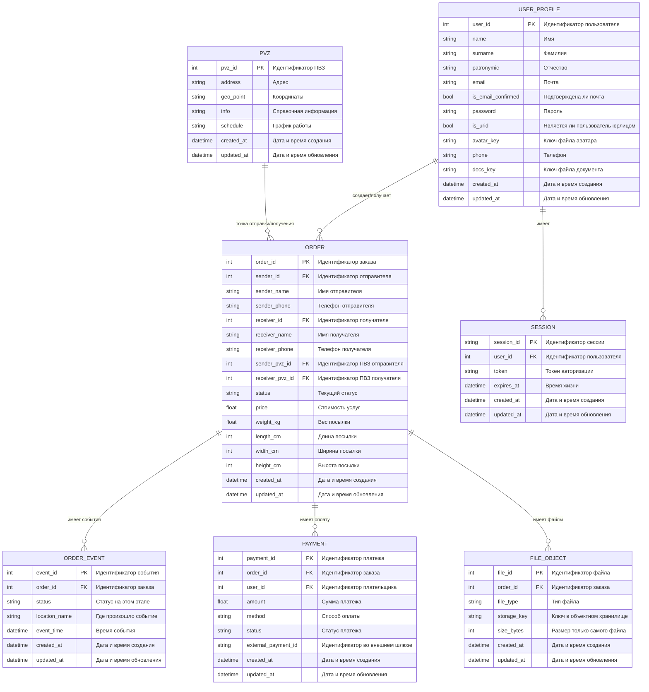
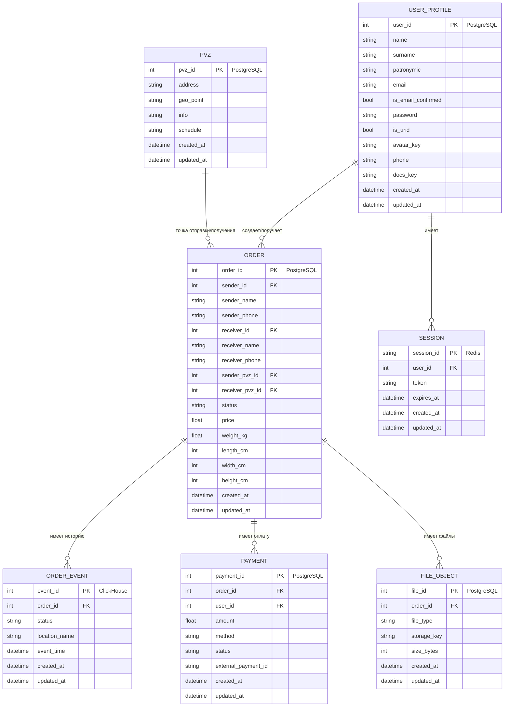
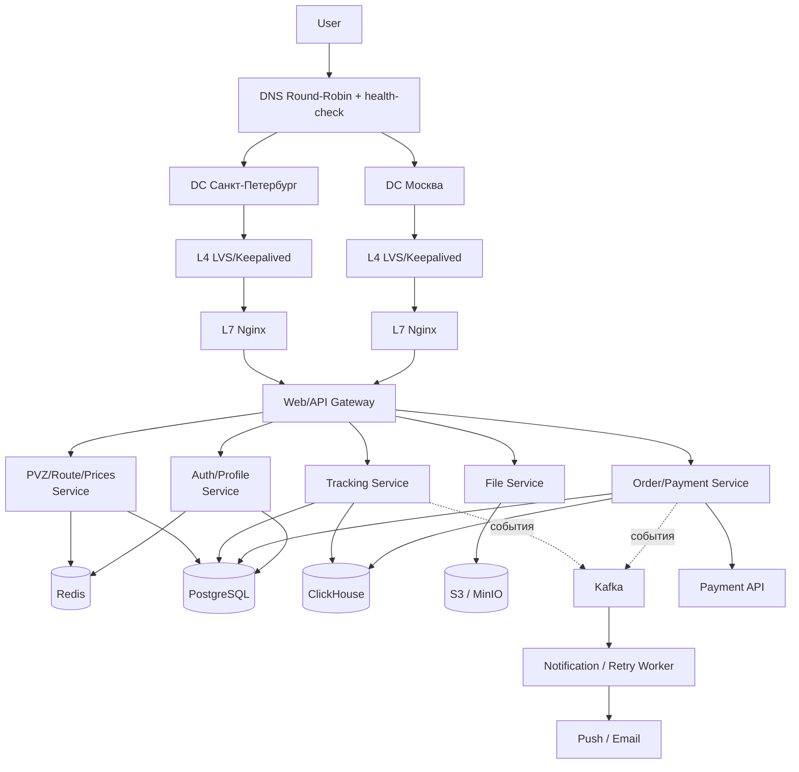

# ДЗ №1: Тема и целевая аудитория сервиса CDEK

**CDEK** — российский оператор доставки документов и грузов.

---

### Целевая аудитория
* **MAU (Monthly Active Users):** 23.6 миллионов (РФ)

### Основной функционал
* Создание заказов
* Трекинг заказов (+ оповещения о статусе заказа)
* Расчет стоимости доставки
* Определение маршрута доставки
* Просмотр пунктов выдачи на картах
* Поиск пунктов выдачи по фильтрам/геолокации
* Интеграция с логистической платформой через CDEK API
* Прием платежей по СБП (CDEK PAY)

### Ссылки и источники
1. [Официальный сайт CDEK](https://www.cdek.ru/)
2. [Статья в Wikipedia](https://ru.wikipedia.org/wiki/%D0%A1%D0%94%D0%AD%D0%9A)
3. [Статистика трафика на similarweb](https://www.similarweb.com/website/cdek.ru/#traffic)

  
# ДЗ №2 Расчет нагрузки для cdek.ru

### Продуктовые метрики

| Метрика | Значение | Пояснение |
| :--- | :--- | :--- |
| **MAU** | **18 600 000** | Взято с официального сайта cdek.ru [[1]](https://www.cdek.ru/)  |
| **DAU** | **3 720 000** | Рассчитано как 20% от MAU [[2]](https://yandex.ru/adv/edu/materials/metriki-mau-wau-dau) |
| **Ср. количество заказов** | **400 000 / день** | 123 млн посылок в год / 365 дней (данные за 2025 год с официального сайта cdek.ru) |
| **Хранение на пользователя** | **~0,5 МБ / 20 объектов** | История заказов за год, данные профиля (реквизиты, сканы документов и прочее) |

#### Действия пользователя
| Действие | Среднее количество запросов в день от одного пользователя|
| :--- | :--- | 
| **Создание заказа** | 0,1 | 
| **Трекинг** | 2,7 | 
| **Расчет стоимости** | 0,7 | 
| **Определение маршрута доставки** | 1,0 | 
| **Поиск ПВЗ** | 0,9 | 
| **CDEK API** | 29,4 | 
| **Итого (без CDEK API)** | **4,2** |

Примечание: CDEK API действия расчитываются на одно юридическое лицо. По данным сайта cdek.ru на 2026 год на платформе зарегистрировано 850 000 активных юр. лиц. [[1]](https://www.cdek.ru/ru/history/)
  
### Технические метрики

Согласно блогу компании на habr.com суммарный объем хранилища составлял > 30 ТБ на конец 2024 года [[3]](https://habr.com/ru/companies/cdek_blog/articles/881618/)

#### Объем хранилища (данные заказов указаны за год)

| Тип данных | Объектов, шт | Объем | Пояснение |
| :--- | :--- | :--- | :--- |
| **Данные заказов** | 123 000 000 | 8.13 ТБ | ~71 КБ/объект |
| **Профили** | 25 000 000 | 0.16 ТБ | ~7 КБ/объект |
| **Пункты выдачи** | 8 600 [[5]](https://calculator-dostavki.ru/cdek-offices) | 0.0006 ТБ | ~73 КБ/объект |
| **Итого** | | **24,55 ТБ** | Данные заказов указаны за год / срок их хранения я не нашел, поэтому примем его равным 3 годам (посчитаем объем данных заказов, как х3)

Примечания:
* Для расчтета размера данных примем, что строчные поля занимают 256 Байт, числовые - 4 Байта, картинки - 70 КБ.

#### Расчет RPS

| Метод | Суточный объем | Средний RPS | Пиковый RPS | Пиковое потребление | Суммарный суточный трафик |
| :--- | :--- | :--- | :--- | :--- | :--- |
| **Создание заказа** | 400 000 | 5 | 25 | 0,029 Гбит/с | 57 ГБ |
| **Трекинг** | 10 000 000 | 115 | 575 | 0,658 Гбит/с | 1431 ГБ |
| **Расчет стоимости** | 2 600 000 | 30 | 150 | 0,172 Гбит/с | 371 ГБ |
| **Определение маршрута доставки** | 4 000 000 | 46 | 230 | 0,263 Гбит/с | 572 ГБ |
| **Поиск ПВЗ** | 3 600 000 | 42 | 210 | 0,240 Гбит/с | 515 ГБ |
| **CDEK API** | 25 000 000 | 289 | 1445 | 1,654 Гбит/с | 3576 ГБ |
| **Итого** | **45 600 000** | **997** | **2 991** | 3,016 Гбит/с | 12 302 ГБ |

Примечания: 
* пиковый RPS рассчитывается, как средний RPS увеличенный в 5 раз (коэффициент посчитан, как отношение пикового и среднего значения RPS для аналагичного сервиса Ozon [[4]](https://speakerdeck.com/ozontech/van-khachatrian-osobiennosti-stiek-i-protsiessy-komandy-poisk-riekomiendatsii-rieklama?slide=12))
* предположим, что запросы распределены равномерно на протяжении дня (в дне 86 400 секунд)
* средний размер ответа 150 КБ или 1 228 800 Бит (проанализировал трафик через инструменты разработчика в хроме)

---

### Ссылки и источники
1. [Официальный сайт CDEK](https://www.cdek.ru/ru/history/)
2. [Статья Яндекса для расчета MAU и DAU](https://yandex.ru/adv/edu/materials/metriki-mau-wau-dau)
3. [Статья в блоге CDEK на хабре](https://habr.com/ru/companies/cdek_blog/articles/881618/)
4. [Презентация Ozon](https://speakerdeck.com/ozontech/van-khachatrian-osobiennosti-stiek-i-protsiessy-komandy-poisk-riekomiendatsii-rieklama?slide=12)
5. [ПВЗ СДЭК](https://calculator-dostavki.ru/cdek-offices)

# ДЗ №3: Глобальная балансировка нагрузки

### Функциональное разбиение по доменам
Для эффективной маршрутизации и изоляции отказов функционал разделен на следующие поддомены:
* **`cdek.ru`** — основной сайт (создание заказов, трекинг, поиск ПВЗ, определение маршрутов).
* **`api.cdek.ru`** — внешний шлюз для интеграции юридических лиц (CDEK API).
* **`pay.cdek.ru`** — платежный шлюз для приема платежей по СБП (CDEK PAY).

### Обоснование расположения ДЦ
Согласно анализу трафика [[1]](https://www.similarweb.com/ru/website/cdek.ru/#geography), подавляющее большинство аудитории сервиса находится в России (92,14%), а также в соседних странах: Беларусь (2,11%) и Казахстан (2,07%). Доля зарубежного трафика крайне мала: Нидерланды — 0,52%, США — 0,44% и другие 2,72%.

### Расположение дата-центров
| Расположение    | Обслуживаемый регион                                         | Обоснование                                                                                                                                                                                                                  |
|:----------------|:-------------------------------------------------------------|:-----------------------------------------------------------------------------------------------------------------------------------------------------------------------------------------------------------------------------|
| Москва          | Центральный федеральный округ, Европа, США, Средняя Азия     | Находится в центре самой густонаселенной части РФ, что обеспечивает минимальную задержку для большинства пользователей, для пользователей Дальнего Востока пинг будет в районе 120 мс [[2]](https://ruvds.com/ru/data/rus/). |
| Санкт-Петербург | Северо-Западный федеральный округ, Европа, США, Средняя Азия | Является резервным для Московского ДЦ, так же удачно расположен в европейской части РФ                                                                                                                                       |

### Распределение запросов по дата-центрам
Пиковый RPS системы составляет 2 991. Пиковое потребление трафика — 3,016 Гбит/с.
Распределим нагрузку по ДЦ:

| Регион (ДЦ)	    | Процент трафика | Пиковый RPS | Пиковое потребление | Суммарный суточный трафик |
|:----------------|:---------------:|:-----------:|:-------------------:|:---------------------------------:|
| Москва          |       50%       |    1496     |     1,5 Гбит/с      |              6151 ГБ              |
| Санкт-Петербург |       50%       |    1496     |     1,5 Гбит/с      |              6151 ГБ              |

* **Схема DNS балансировки:** Для распределения трафика между Москвой и Санкт-Петербургом используется Round-Robin.
* **Механизм регулировки трафика:** Реализуется через health-check. Если один из ДЦ перестает отвечать, с DNS-сервера исключается его IP из выдачи и перераспределяет трафик на оставшиеся живые ДЦ.

### Ссылки и источники
1. [Similarweb](https://www.similarweb.com/ru/website/cdek.ru/#geography)
2. [Пинг от Москвы до ДЦ во Владивостоке](https://ruvds.com/ru/data/rus/)

# ДЗ №4: Локальная балансировка нагрузки

Локальная балансировка обеспечивает распределение трафика внутри одного дата-центра между физическими серверами

## Схема балансировки нагрузки

Уровни балансировки:

1.  **Уровень L4**
    * **Механизм:** Используем Virtual IP, потом входящий трафик после глобальной балансировки поступает балансировщик, затем он перенаправляет пакеты на нужный сервер с помощью NAS/Direct Routing/IP Tunneling
    * **Технологии:** LVS или Nginx/HAProxy
    * **Формула резервирования:** N*2

2.  **Уровень L7**
    * **Механизм:** Балансировщик полностью разрывает сетевое соединение с клиентом, дешифрует трафик и анализирует его изнутри. Только после этого он открывает новое соединение с подходящим сервером приложения
    * **Технологии:** Nginx/HAProxy
    * **Формула резервирования:** N+1

## Показатели производительности (на базе Nginx)

Согласно тестам производительности Nginx, при планировании мощностей следует учитывать:

* **Производительность Nginx Ingress Controller (L7 балансировщик):**
    * На 1-ядерном процессоре обеспечивает 28 640 RPS при обработке HTTPS трафика [[1]](https://blog.nginx.org/blog/testing-performance-nginx-ingress-controller-kubernetes)
    * На 1-ядерном процессоре обеспечивает около 4 433 TPS (transactions per second) при обработке HTTPS трафика [[1]](https://blog.nginx.org/blog/testing-performance-nginx-ingress-controller-kubernetes)
  
* **Производительность Nginx Web Server:**
    * На 1-ядерном процессоре обеспечивает 4 830 RPS при обработке HTTPS трафика (для объема данных 100 КБ) [[2]](https://blog.nginx.org/blog/testing-the-performance-of-nginx-and-nginx-plus-web-servers)
    * На 1-ядерном процессоре обеспечивает 34 344 СPS (connections per second) при обработке HTTPS трафика [[2]](https://blog.nginx.org/blog/testing-the-performance-of-nginx-and-nginx-plus-web-servers)

---

### Ссылки и источники
1. [Nginx Blog: Testing Performance Nginx Ingress Controller (2019)](https://blog.nginx.org/blog/testing-performance-nginx-ingress-controller-kubernetes)
2. [Nginx Blog: Testing the Performance of Nginx and Nginx Plus (2017)](https://blog.nginx.org/blog/testing-the-performance-of-nginx-and-nginx-plus-web-servers)

# ДЗ №5: Логическая схема БД и масштабирование данных

## Логическая схема базы данных

## Описание таблиц

| Сущность          | Описание данных                                                  | Кол-во объектов      | Объем данных | Чтение (Пик QPS) | Запись (Пик QPS) |
|:------------------|:-----------------------------------------------------------------|:---------------------|:-------------|:-----------------|:-----------------|
| **USER_PROFILE**  | Профиль пользователя, контакты и реквизиты                       | 25 000 000           | ~0,18 ТБ     | ~450             | ~15              |
| **ORDER**         | Карточка заказа, текущий статус и снэпшоты ФИО/телефонов         | 369 000 000          | ~0,66 ТБ     | ~900             | ~25              |
| **ORDER_EVENT**   | История заказа: каждое изменение статуса и местоположения        | 3 690 000 000        | ~1,40 ТБ     | ~575             | ~230             |
| **PAYMENT**       | Онлайн-платежи и их статусы                                      | 258 000 000          | ~0,10 ТБ     | ~120             | ~25              |
| **PVZ**           | Справочник ПВЗ, координаты и график работы                       | 8 600                | ~0,0006 ТБ   | ~210             | << 1             |
| **SESSION**       | Сессии авторизации с TTL                                         | 3 720 000 (активные) | ~0,002 ТБ    | ~900             | ~90              |
| **FILE_OBJECT**   | Только метаданные файлов заказа, бинарные данные лежат в S3/MinIO| 900 000 000          | ~0,29 ТБ     | ~80              | ~30              |

## Требования к консистентности

Чтение масштабируем через реплики.
* **Strong consistency:** нужна для создания заказа, смены текущего статуса заказа, создания платежа и подтверждения оплаты.
* **Eventual consistency:** подходит для истории трекинга, списка ПВЗ, файловых метаданных и чтения профиля с реплик.
* **Кеширование:** для поиска ПВЗ, расчета маршрута и расчета стоимости используем Redis.
* **Идемпотентность:** для платежей и смены статуса нужен повторяемый запрос без дублей. Для этого используем `external_payment_id` и уникальный ключ события.

## Особенности нагрузки

* **USER_PROFILE** и **SESSION** чаще всего читаются по `user_id`.
* **ORDER**, **PAYMENT** и **FILE_OBJECT** привязаны к `order_id`.
* **ORDER** денормализована по пользовательским полям, чтобы выдавать карточку заказа и список отправлений без дополнительного `JOIN` к профилю.
* **ORDER_EVENT** это таблица истории заказа. Ее обычно читают по `order_id` и времени события.
* **PVZ** мало по объему, поэтому здесь достаточно гео-индекса и реплики для чтения.

# ДЗ №6: Физическая схема БД

## Физическая схема БД

## Выбор СУБД

| Таблица          | СУБД                    | Шардирование | Резервирование                                        |
|:-----------------|:------------------------|:-------------|:------------------------------------------------------|
| **USER_PROFILE** | PostgreSQL              | нет          | Master-Slave                                          |
| **ORDER**        | PostgreSQL              | нет          | Master-Slave                                          |
| **PAYMENT**      | PostgreSQL              | нет          | Master-Slave                                          |
| **PVZ**          | PostgreSQL              | нет          | Master-Slave                                          |
| **ORDER_EVENT**  | ClickHouse              | нет          | 2 реплики                                             |
| **SESSION**      | Redis                   | нет          | master + replica                                      |
| **FILE_OBJECT**  | PostgreSQL + S3 / MinIO | нет          | метаданные в PostgreSQL, файлы реплицируются между ДЦ |

## Обоснование конфигураций

* **PostgreSQL** берем для профилей, заказов, платежей, ПВЗ и метаданных файлов, потому что здесь важны транзакции, внешние ключи и обычные индексы.
* **ClickHouse** нужен только для **ORDER_EVENT**. Это большая таблица истории заказа. В ней много записей, они почти не обновляются, и ее удобно хранить отдельно от основной базы, чтобы история не мешала заказам и платежам.
* **Redis** используем для **SESSION** и кеша частых маршрутов/стоимости, потому что здесь важны маленькая задержка.
* **S3 / MinIO** используем для бинарных файлов, потому что хранить сами фото и документы в основной БД не нужно.

## Индексы

| Таблица          | Индексы и ключи                                                                                                        |
|:-----------------|:-----------------------------------------------------------------------------------------------------------------------|
| **USER_PROFILE** | `PK(user_id)`, `UNIQUE(email)`, `UNIQUE(phone)`                                                                        |
| **ORDER**        | `PK(order_id)`, `IDX(sender_id, created_at desc)`, `IDX(receiver_id, created_at desc)`, `IDX(status, updated_at desc)` |
| **PAYMENT**      | `PK(payment_id)`, `UNIQUE(external_payment_id)`, `IDX(order_id)`, `IDX(user_id, created_at desc)`                      |
| **PVZ**          | `PK(pvz_id)`, `GIST(location)`                                                                                         |
| **ORDER_EVENT**  | `ORDER BY (order_id, event_time)`                                                                                      |
| **SESSION**      | `session_id`                                                                                                           |
| **FILE_OBJECT**  | `PK(file_id)`, `IDX(order_id)`, `IDX(file_type, created_at desc)`                                                      |

### Расчет размеров индексов

index_size = число_строк * (размер_ключа_индекса + указатель_на_строку) * 1.3

| Индекс                                     | Расчет                     | Размер      |
|:-------------------------------------------|:---------------------------|:------------|
| **USER_PROFILE PK(user_id)**               | 25M * (4 + 8) * 1.3        | ~0,39 ГБ    |
| **USER_PROFILE UNIQUE(email)**             | 25M * (40 + 8) * 1.3       | ~1,56 ГБ    |
| **USER_PROFILE UNIQUE(phone)**             | 25M * (16 + 8) * 1.3       | ~0,78 ГБ    |
| **ORDER PK(order_id)**                     | 369M * (4 + 8) * 1.3       | ~5,76 ГБ    |
| **ORDER IDX(sender_id, created_at)**       | 369M * (4 + 8 + 8) * 1.3   | ~9,59 ГБ    |
| **ORDER IDX(receiver_id, created_at)**     | 369M * (4 + 8 + 8) * 1.3   | ~9,59 ГБ    |
| **ORDER IDX(status, updated_at)**          | 369M * (16 + 8 + 8) * 1.3  | ~15,35 ГБ   |
| **PAYMENT PK(payment_id)**                 | 258M * (4 + 8) * 1.3       | ~4,02 ГБ    |
| **PAYMENT UNIQUE(external_payment_id)**    | 258M * (36 + 8) * 1.3      | ~14,76 ГБ   |
| **PAYMENT IDX(order_id)**                  | 258M * (4 + 8) * 1.3       | ~4,02 ГБ    |
| **PAYMENT IDX(user_id, created_at)**       | 258M * (4 + 8 + 8) * 1.3   | ~6,71 ГБ    |
| **PVZ PK(pvz_id)**                         | 8.6K * (4 + 8) * 1.3       | ~0,00013 ГБ |
| **PVZ GIST(location)**                     | 8.6K * (32 + 8) * 1.3      | ~0,00042 ГБ |
| **FILE_OBJECT PK(file_id)**                | 900M * (4 + 8) * 1.3       | ~14,04 ГБ   |
| **FILE_OBJECT IDX(order_id)**              | 900M * (4 + 8) * 1.3       | ~14,04 ГБ   |
| **FILE_OBJECT IDX(file_type, created_at)** | 900M * (16 + 8 + 8) * 1.3  | ~37,44 ГБ   |
| **Итого по PostgreSQL индексам**           |                            | **~138 ГБ** |

## Денормализация

* В **ORDER** храним текущий статус заказа, хотя полная история лежит в **ORDER_EVENT**.
* В **ORDER** денормализуем `sender_name`, `sender_phone`, `receiver_name`, `receiver_phone`.
* В **PAYMENT** храним `order_id` и текущий статус оплаты, чтобы быстро показывать их в карточке заказа.

## Балансировка запросов и мультиплексирование

* Перед PostgreSQL можно поставить `PgBouncer`, чтобы не держать слишком много прямых соединений от всех инстансов.
* Для сетевой балансировки запросов к PostgreSQL и Redis ставим `Nginx` на уровне TCP.
* Запись в PostgreSQL идет в мастер, чтение можно уводить на реплику.
* Для Redis клиент работает через Sentinel и ходит в текущий master после переключения.
* Для ClickHouse используем отдельный клиент только для чтения истории заказа.

## Клиентские библиотеки / интеграции

* **PostgreSQL:** `PostgreSQL JDBC Driver` + `HikariCP`
* **Redis:** `Lettuce`
* **ClickHouse:** `ClickHouse Java client`
* **S3 / MinIO:** `AWS SDK for Java` / `MinIO Java SDK`

## Шардирование и резервирование

* На текущем объеме отдельный шардинг не нужен, потому что основные таблицы пока можно держать на одном Master с репликой.
* Для **ORDER_EVENT** вместо шардинга достаточно партиций по времени. Так проще удалять старые данные и быстрее читать историю по диапазону дат.
* **PostgreSQL:** `Master-Slave` и автоматический failover. Primary принимает запись, replica держим для чтения и быстрого переключения при сбое.
* **ClickHouse:** 2 реплики. Одна рабочая и одна резервная, чтобы не потерять историю при отказе узла.
* **Redis:** `Master-Slave`, переключение через Sentinel. Это нужно, чтобы сессии быстро пережили отказ master.
* **S3 / MinIO:** репликация между ДЦ.

## Схема резервного копирования

* **PostgreSQL:** WAL archive каждые 5 минут.
* **ClickHouse:** ежедневные snapshot.
* **Redis:** `RDB + AOF`, при этом временный кеш можно пережить даже с частичной потерей.
* **S3 / MinIO:** репликация между ДЦ.

# ДЗ №7: Алгоритмы

### 1. Подбор ПВЗ

**Наименование алгоритма, метода или подхода:**  
Поиск ближайших ПВЗ по геоиндексу с последующей фильтрацией.

**Блок, подсистема или функция:**  
PVZ Service, поиск пунктов выдачи на карте и при оформлении заказа.

**Постановка решаемой задачи:**  
Найти для пользователя ближайшие доступные ПВЗ, которые подходят по географии, ограничениям заказа и доступным услугам.

**Исходные данные, ограничения и требования к результату:**  
На вход подаются город, адрес или координаты пользователя, а также параметры заказа: вес, габариты, тип доставки, дополнительные услуги. Требуется вернуть ограниченный список релевантных ПВЗ с низкой задержкой ответа. Полный перебор всех точек неприемлем из-за роста числа ПВЗ и лишней нагрузки на БД.

**Последовательность работы алгоритма:**
1. Пользователь передает город, координаты или адрес.
2. PVZ Service нормализует вход и определяет точку поиска.
3. В PostgreSQL/PostGIS выполняется запрос по геоиндексу для поиска ближайших ПВЗ в заданном радиусе.
4. Найденные точки фильтруются по графику работы, услугам, ограничениям по весу и габаритам.
5. Результаты сортируются по расстоянию и служебным приоритетам.
6. Первые 10-30 ПВЗ возвращаются пользователю и кратковременно кешируются в Redis.

**Используемые структуры данных:**  
Таблица ПВЗ в PostgreSQL, геопространственный индекс PostGIS, кеш Redis для популярных запросов поиска.

**Рассматриваемые альтернативные решения:**  
Полный перебор всех ПВЗ в памяти приложения, предварительный расчет фиксированных списков ПВЗ по районам.

**Обоснование выбора алгоритма и его параметров:**  
Поиск по геоиндексу дает предсказуемое время ответа и снимает необходимость переносить всю геологику в приложение. Ограничение выдачи первыми 20-50 точками уменьшает сетевой трафик и упрощает интерфейс. Краткий TTL кеша снижает повторную нагрузку на БД при частых однотипных поисках.

**Влияние на физическую схему БД, профиль нагрузки и взаимодействие компонентов:**  
Нужен геоиндекс PostGIS и хранение координат ПВЗ в отдельной таблице. Нагрузка в основном на чтение, поэтому целесообразны кеширование и чтение с реплик. 
PVZ Service взаимодействует с Redis и PostgreSQL.

### 2. Расчет маршрута и тарифа

**Наименование алгоритма, метода или подхода:**  
Табличный расчет стоимости заказа по тарифным зонам и набору коэффициентов.

**Блок, подсистема или функция:**  
Route Service, калькулятор доставки и предварительный расчет при создании заказа.

**Постановка решаемой задачи:**  
Рассчитать стоимость и ориентировочный срок доставки на основе параметров отправления без запуска сложной логики в реальном времени.

**Исходные данные, ограничения и требования к результату:**  
На вход подаются города отправки и получения, вес, габариты, тип доставки и дополнительные услуги. 
Требуется получить корректный и быстрый расчет цены и срока. Время ответа должно быть малым, а формула расчета должна быть стабильной.

**Последовательность работы алгоритма:**
1. Route Service принимает города отправки и получения, вес, габариты и тип доставки.
2. По таблице тарифных зон определяется базовый маршрутный сегмент.
3. Из тарифной таблицы выбираются базовая цена и базовый срок доставки.
4. Применяются коэффициенты за вес, объем, страховку, срочность и дополнительные услуги.
5. Для часто повторяющихся комбинаций результат может быть взят из кеша или сохранен в кеш.
6. Пользователю возвращаются итоговая цена и ориентировочный срок доставки.

**Используемые структуры данных:**  
Таблицы тарифных зон, тарифных коэффициентов в PostgreSQL, Redis для кеширования популярных расчетов.

**Рассматриваемые альтернативные решения:**  
Онлайн-оптимизация маршрута на графе перевозок; динамический расчет через ML-модель;

**Обоснование выбора алгоритма и его параметров:**  
Расчет получается достаточно точным, при минимальной нагрузке на систему.

**Влияние на физическую схему БД, профиль нагрузки и взаимодействие компонентов:**  
Требуется хранение нормализованных таблиц тарифных зон и коэффициентов с индексами по маршруту и типу доставки. 
Основная нагрузка приходится на чтение, поэтому важны кеш и реплики для PostgreSQL.
Межсервисное взаимодействие минимально тк расчет может выполняться локально внутри Route Service.

# ДЗ №8: Технологии

При выборе технологий опираемся на материалы лекции: берем open source как базу, минимизируем количество разных стеков и разделяем технологии по зонам ответственности.

| Технология                     | Область применения                                | Мотивация                                                                                      |
|:-------------------------------|:--------------------------------------------------|:-----------------------------------------------------------------------------------------------|
| **LVS + Keepalived**           | L4 балансировка                                   | Простая и быстрая схема для VIP и failover                                                     |
| **Nginx**                      | Front proxy, L7, SSL termination                  | Хорошо подходит под HTTP-трафик, health-check и маршрутизацию по доменам                       |
| **REST / HTTP**                | Внешний API для сайта и партнеров                 | Понятный интерфейс, удобно интегрировать юридических лиц и фронтенд                            |
| **gRPC**                       | Внутренние синхронные вызовы                      | Меньше накладные расходы и строгий контракт                                                    |
| **Kafka**                      | Асинхронные события и очереди                     | Подходит для event-driven схемы, outbox, retry и fan-out уведомлений                           |
| **Java 21 + Spring Boot**      | Backend сервисы                                   | Подходит под большой корпоративный сервис, зрелая экосистема и много готовых интеграций        |
| **PostgreSQL**                 | Основные транзакционные данные                    | Транзакции, индексы, репликация                                                                |
| **Redis**                      | Сессии и кеш                                      | Обеспечивает низкую задержку и подходит для короткоживущих горячих данных                      |
| **ClickHouse**                 | История статусов и аналитические логи             | Хорош для нагрузки только на добавление и больших выборок                                      |
| **S3 / MinIO**                 | Фото, документы, чеки, наклейки                   | Для бинарных файлов это лучше, чем хранить их в реляционной БД                                 |
| **React + TypeScript**         | Web frontend                                      | Компонентная модель, типизация и быстрый цикл разработки клиентского кабинета                  |
| **MapLibre / Yandex Maps SDK** | Карта ПВЗ на web и mobile                         | Ключевая часть продукта, нужна работа с картой, маркерами и геопоиском                         |
| **Swift**                      | iOS приложение                                    | Нативный стек для push, геолокации, background refresh и карт                                  |
| **Kotlin**                     | Android приложение                                | Нативный стек для пушей, карт и интеграции с платформенными API                                |
| **Kubernetes**                 | Оркестрация stateless-сервисов                    | Упрощает раскатку, autoscaling и rolling update                                                |
| **HikariCP + PgBouncer**       | Пул соединений и мультиплексирование к PostgreSQL | Снижают число прямых коннектов от Java-сервисов                                                |
| **Prometheus + Grafana**       | Метрики, дашборды, алерты                         | Хорошо подходят для временных рядов, SLA/SLO и алертинга                                       |
| **ElasticSearch + Kibana**     | Централизованный сбор и анализ логов              | Удобные инструменты для хранения и анализа технических логов                                   |

# ДЗ №9: Обеспечение надежности

Надежность сервиса строится на паттернах из лекции 10: резервирование, сегментирование, failover policy, graceful shutdown, graceful degradation и асинхронные паттерны доставки данных.

### Основные подходы

| Подход                      | Реализация                                                                 | Результат                                                      |
|:----------------------------|:---------------------------------------------------------------------------|:---------------------------------------------------------------|
| **Резервирование**          | Запас по CPU/RAM, резервирование серверов, дисков, ДЦ и БД                 | Сервис продолжает работу при отказе отдельных узлов            |
| **Сегментирование**         | Разделение критичных API и фоновых задач                                   | Деградация затрагивает не весь продукт, а только часть функций |
| **Failover policy**         | Исключение проблемных хостов и переключение на реплики                     | Ускоряется восстановление и снижается каскад отказов           |
| **Graceful shutdown**       | Инстанс перестает принимать новые запросы и дожидается завершения активных | Обновления и перезапуски проходят без потери запросов          |
| **Graceful degradation**    | При аварии сохраняются логин, трекинг и просмотр заказа                    | Пользователь сохраняет доступ к основным сценариям             |

### Сегментирование API

| Группа       | Состав                                                 | Приоритет                                                      |
|:-------------|:-------------------------------------------------------|:---------------------------------------------------------------|
| **Группа 1** | Авторизация, профиль, трекинг заказа                   | Самые частые и критичные запросы, сохраняются в первую очередь |
| **Группа 2** | Создание заказа и платеж                               | Бизнес-критичный путь, требует отдельного контроля отказов     |
| **Группа 3** | Расчет маршрута, поиск ПВЗ, загрузка фото и документов | Может ограничиваться или отключаться при аварии                |

### Резервирование по компонентам

| Компонент                | Методы надежности                                                        | Резервирование и поведение при отказе                              | Что это дает                                                      |
|:-------------------------|:-------------------------------------------------------------------------|:-------------------------------------------------------------------|:------------------------------------------------------------------|
| **DNS / GSLB**           | Health-check, failover policy                                            | При падении ДЦ его IP убирается из DNS-выдачи                      | Трафик уходит в живой ДЦ                                          |
| **L4 балансировщики**    | Резервирование, failover policy                                          | Схема N*2, обычно пара active-standby                              | Не теряем VIP при падении ноды                                    |
| **L7**                   | Резервирование, сегментирование, graceful shutdown                       | Схема N+1                                                          | Сохраняем доступность при падении одного proxy и при перезапусках |
| **Backend сервисы**      | Резервирование, сегментирование, graceful shutdown, graceful degradation | Схема N+1                                                          | Авария не выводит из строя весь сервис                            |
| **Kafka**                | Репликация, idempotent producer/consumer                                 | RF=3, consumer group, повторное чтение по offset                   | Сообщения не теряются при отказе брокера или consumer             |
| **PostgreSQL**           | Резервирование, failover policy                                          | Primary + replica + read replica                                   | БД быстро переключается на резерв                                 |
| **ClickHouse**           | Резервирование, graceful degradation                                     | 2 реплики                                                          | История и логи доступны даже при отказе ноды                      |
| **Redis**                | Резервирование, failover policy, graceful degradation                    | Master-Slave + Sentinel, при потере кеша данные дочитываются из БД | Сессии восстанавливаются быстро, кеш можно прогреть заново        |
| **S3 / MinIO**           | Резервирование, graceful degradation                                     | Репликация между ДЦ                                                | Файлы сохраняются при отказе диска или узла                       |
| **Внешний payment API**  | Circuit breaker, retry, идемпотентность                                  | Платеж переводится в `PENDING`, повтор идет фоном                  | Кратковременные сбои интеграции не ломают платежный путь          |

### 1. Outbox для создания заказа и оплаты

Этот паттерн нужен, чтобы после успешной транзакции в PostgreSQL не потерять событие для Kafka.

**Проблема:**  
Заказ уже записан в ORDER, но в момент публикации события о новом заказе брокер Kafka недоступен.

**Алгоритм:**
1. Order Service в одной транзакции пишет заказ, платежный статус и запись в outbox.
2. Пользователь получает ответ, что заказ создан.
3. Отдельный outbox-processor читает outbox и пытается отправить событие в Kafka.
4. Если Kafka недоступна, запись остается в outbox, а outbox-processor повторяет отправку.
5. После успешной публикации запись помечается как обработанная.

**Что это дает:**  
Не возникает расхождения, что данные в БД есть, а события в очереди нет. Основной пользовательский сценарий не ломается из-за временной недоступности брокера.

### 2. Saga для создания заказа, оплаты и резервирования доставки

Этот паттерн нужен для координации распределенной операции между несколькими сервисами путем объединения этих транзакций в сагу.

**Проблема:**  
Заказ создан, оплата прошла успешно, но сервис доставки не смог зарезервировать слот или подтвердить сборку.

**Алгоритм:**
1. Order Service создает заказ в статусе PENDING.
2. Payment Service списывает оплату и публикует событие об успешном платеже.
3. Delivery Service пытается зарезервировать слот доставки или ПВЗ.
4. Если все прошло успешно, saga завершает процесс и подтверждает заказ.
5. Если какая-то операция зафейлилась, запускаются серия транзакций ревертов: заказ отменяется, а Payment Service делает возврат или переводит платеж в статус возврата.

**Что это дает:**  
Сервисы остаются слабо связанными, а бизнес-процесс создания заказа завершается консистентно даже при частичном отказе одного из участников.

### 3. Graceful degradation

**Алгоритм:**  
Недоступен PVZ Service, деградирует поиск или временно медленно отвечает Route Service.

**Как это работает:**
1. В личном кабинете остаются доступны логин, список заказов и трекинг.
2. Поиск ПВЗ отдается из кеша или показывается последнее успешное значение.
3. Калькулятор доставки может вернуть сообщение "расчет временно недоступен", не ломая другие страницы.

**Что это дает:**  
Сервис деградирует частично, а не целиком.

# ДЗ №10: Схема проекта

## Схема взаимодействия компонентов

## Пояснения к схеме

* Внешняя балансировка: между двумя ДЦ используем DNS Round-Robin с health-check. Если один ДЦ недоступен, его IP убирается из выдачи.
* Внутренняя балансировка: внутри ДЦ трафик идет через L4 VIP на L7 Nginx, а затем разводится по gateway и микросервисам.
* Логин, создание заказа, получение списка заказов, трекинг, поиск ПВЗ и оплата идут через HTTP/gRPC в основной сервисный слой через Gateway.
* Cобытия о заказах, оплатах и смене статусов публикуются в Kafka, после чего расходятся на уведомления и фоновые обработчики.
* PostgreSQL хранит структурированные данные, ClickHouse хранит длинную историю статусов, Redis хранит сессии и кеш, MinIO хранит бинарные файлы.

# ДЗ №11: Список серверов

Пиковая внешняя нагрузка системы составляет 2 991 RPS и 3,016 Гбит/с, то есть на один ДЦ в active-active схеме приходится примерно 1 496 RPS и 1,5 Гбит/с.

## Базовый расчет ресурсов

Для прикидки используем оценку: Java/Spring Boot сервис средней сложности требует порядка 1 CPU на 80-150 RPS

| Сервис                         | Целевая пиковая нагрузка | CPU   | RAM   | Комментарий                            |
|:-------------------------------|:-------------------------|:------|:------|:---------------------------------------|
| **API Gateway**                | ~3 000 RPS               | 8 CPU | 8 GB  | принимает весь внешний HTTP-трафик     |
| **Auth/Profile Service**       | ~300 RPS                 | 4 CPU | 8 GB  | логин, сессии, профиль                 |
| **Order/Payment Service**      | ~500 RPS                 | 8 CPU | 16 GB | создание заказа, чтение заказа, оплата |
| **Tracking Service**           | ~575 RPS                 | 8 CPU | 16 GB | самый частый пользовательский сценарий |
| **PVZ/Route/Prices Service**   | ~590 RPS                 | 8 CPU | 16 GB | поиск ПВЗ, маршрут, тариф              |
| **File Service**               | ~100 RPS                 | 2 CPU | 4 GB  | метаданные файлов и доступ к S3/MinIO  |
| **Notification/Retry Workers** | ~100-200 msg/s           | 4 CPU | 8 GB  | фоновые уведомления и повторы          |

Суммарно требуется около 42 CPU и 76 GB RAM без учета запаса. Для схемы без оркестрации распределяем сервисы по отдельным пулам виртуальных машин и оставляем резерв по N+1.

## Выбор модели развертывания

* **Приложения запускаем без оркестрации** на выделенных виртуальных машинах.
* **Stateful-компоненты** также размещаем на отдельных серверах: PostgreSQL, ClickHouse, Redis, Kafka, MinIO, monitoring.

## Выбор модели хостинга

## Сервера

Для оценки стоимости берем грубые порядки цен:

* цены ориентировочные и приведены диапазонами;
* ориентир по покупке серверов берем по публичным ценам ServerMall, ориентир по аренде по публичным прайсам и документации Selectel.

| Роль / пул               | Конфигурация одного сервера              | Кол-во  | Размещение      | Что размещаем                                               | Покупка за 1 сервер  | Аренда за 1 сервер в месяц  |
|:-------------------------|:-----------------------------------------|:--------|:----------------|:------------------------------------------------------------|:---------------------|:----------------------------|
| **L4 балансировщики**    | 4 CPU, 8 GB RAM, 2x10GbE                 | 4       | 2 Москва, 2 СПб | LVS + Keepalived                                            | 100 000-150 000 RUB  | 4 000-8 000 RUB             |
| **L7 балансировщики**    | 8 CPU, 16 GB RAM, 2x10GbE                | 4       | 2 Москва, 2 СПб | Nginx                                                       | 150 000-220 000 RUB  | 6 000-12 000 RUB            |
| **App general**          | 16 CPU, 64 GB RAM, 2x960 GB NVMe         | 6       | 3 Москва, 3 СПб | API Gateway, Auth/Profile, File Service                     | 280 000-380 000 RUB  | 12 000-20 000 RUB           |
| **App core**             | 16 CPU, 64 GB RAM, 2x960 GB NVMe         | 4       | 2 Москва, 2 СПб | Order/Payment, Tracking, PVZ/Route/Prices                   | 280 000-380 000 RUB  | 12 000-20 000 RUB           |
| **App async**            | 8 CPU, 32 GB RAM, 2x960 GB NVMe          | 2       | 1 Москва, 1 СПб | Notification Worker, Outbox Processor                       | 180 000-260 000 RUB  | 8 000-14 000 RUB            |
| **PostgreSQL**           | 32 CPU, 128 GB RAM, 2x3.84 TB NVMe       | 3       | 2 Москва, 1 СПб | USER_PROFILE, ORDER, PAYMENT, PVZ, TARIFF_ZONE, FILE_OBJECT | 550 000-750 000 RUB  | 25 000-40 000 RUB           |
| **ClickHouse**           | 16 CPU, 64 GB RAM, 2x7.68 TB NVMe        | 2       | 1 Москва, 1 СПб | ORDER_EVENT                                                 | 450 000-650 000 RUB  | 20 000-35 000 RUB           |
| **Redis / Sentinel**     | 8 CPU, 32 GB RAM, 512 GB NVMe            | 3       | 2 Москва, 1 СПб | сессии и кеш                                                | 170 000-240 000 RUB  | 7 000-12 000 RUB            |
| **Kafka brokers**        | 16 CPU, 64 GB RAM, 2 TB NVMe             | 3       | 2 Москва, 1 СПб | event streaming и очереди                                   | 300 000-420 000 RUB  | 15 000-25 000 RUB           |
| **MinIO**                | 8 CPU, 32 GB RAM, 8 TB HDD + 512 GB NVMe | 4       | 2 Москва, 2 СПб | фото, документы, наклейки                                   | 350 000-500 000 RUB  | 14 000-24 000 RUB           |
| **Monitoring / Logging** | 8 CPU, 32 GB RAM, 1 TB NVMe              | 2       | 1 Москва, 1 СПб | Prometheus, Grafana, ElasticSearch, Kibana                  | 200 000-280 000 RUB  | 8 000-15 000 RUB            |

Итоговая оценка:
* покупка всего железа: порядка 6,5-9,0 млн RUB;
* аренда всего парка: порядка 270 000-430 000 RUB в месяц;
* амортизация при покупке на 5 лет: порядка 110 000-150 000 RUB в месяц без учета стоек, сети и поддержки.

Такой состав дает запас по схеме N+1 и позволяет независимо масштабировать внешний API, трекинг, поиск ПВЗ и фоновые обработчики без оркестрации.
